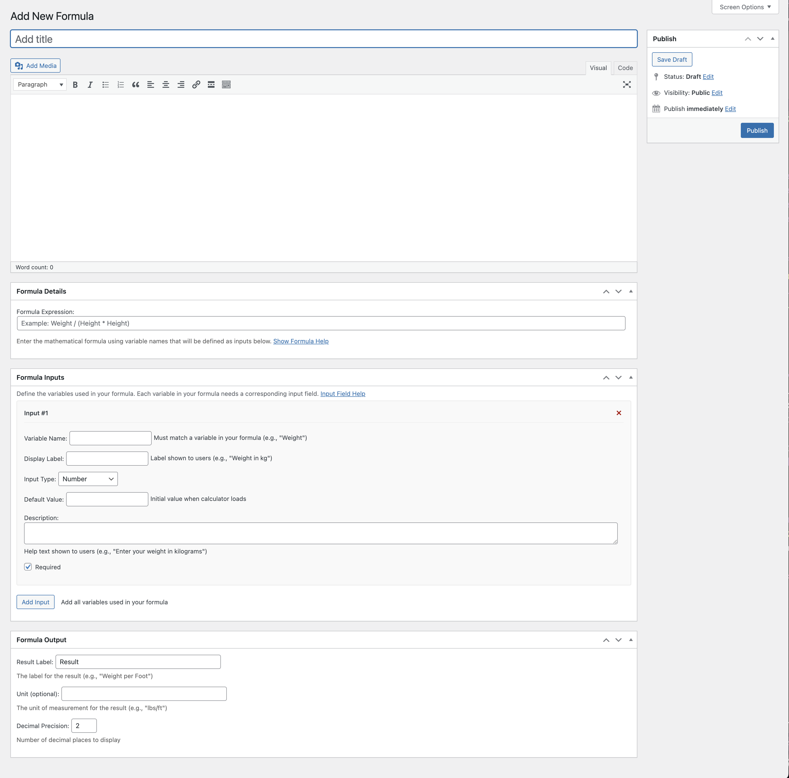
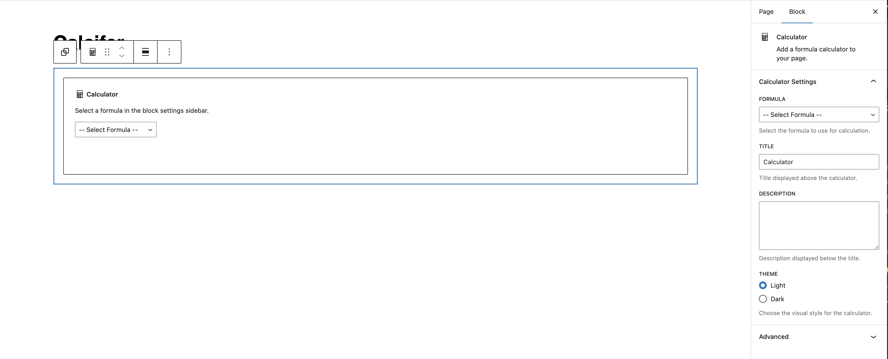
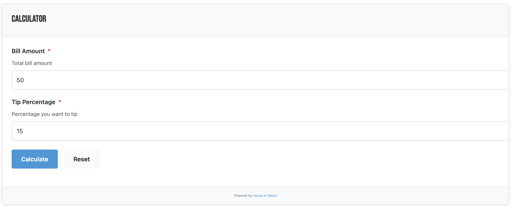
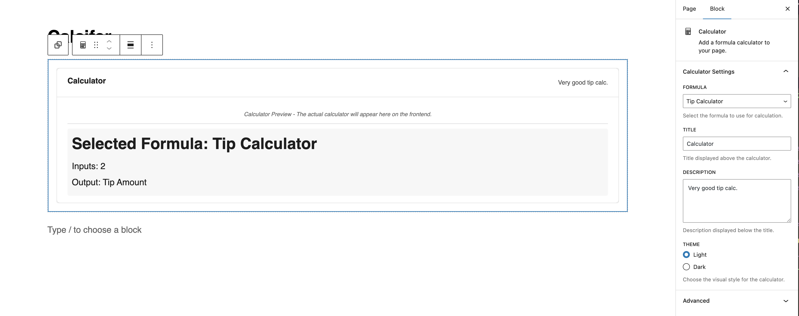
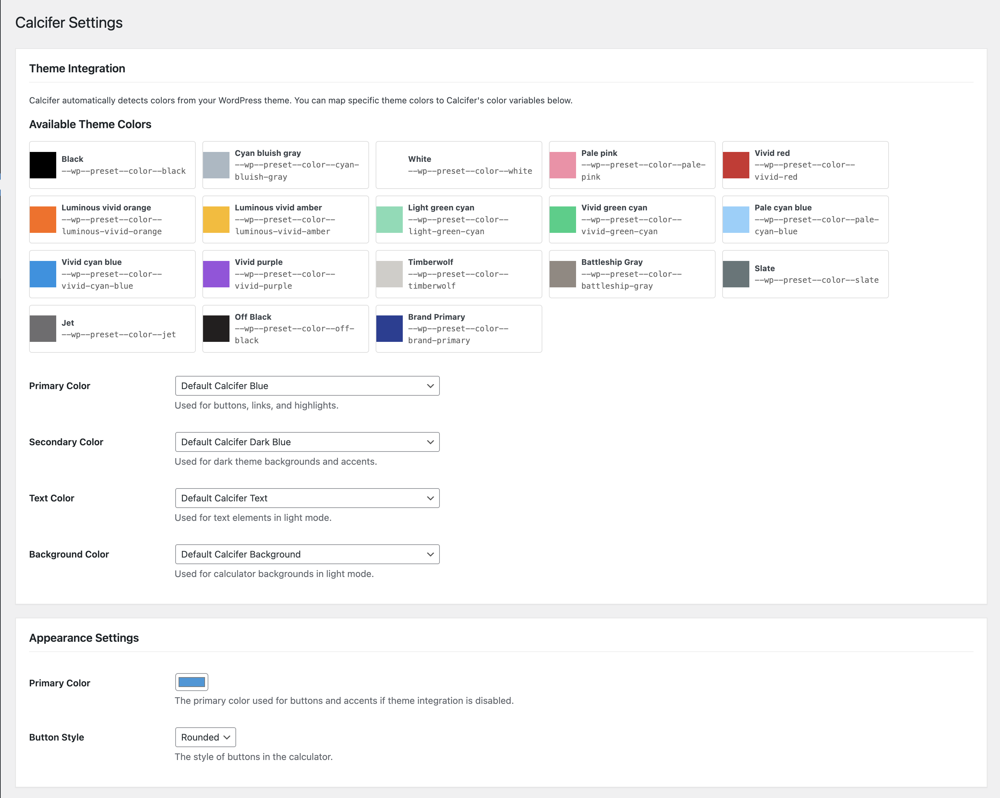

# Calcifer

A flexible WordPress calculator plugin that allows users to create custom formulas and display them as Gutenberg blocks.

[](https://houseofgiants.gumroad.com/l/calcifer)


## Description

Calcifer is a versatile tool that enables website owners to create customized calculators with their own formulas. Whether you're calculating BMI, percentages, tip amounts, or any other mathematical formula, this plugin makes it easy to implement and display interactive calculators on your WordPress site.

### Features

- Create unlimited custom calculators
- Define your own mathematical formulas
- Create multiple input fields with validation
- Customize the appearance with light and dark themes
- Add calculators anywhere using Gutenberg blocks
- Automatic theme color integration with block themes
- Responsive design for all devices
- Clean, modern interface
- Developer-friendly architecture

## Distribution Note

We've made a conscious decision to distribute Calcifer exclusively through Gumroad rather than through the WordPress Plugin Directory. This decision reflects our desire to maintain full control over our plugin's development and distribution channels in light of recent changes to WordPress's plugin ecosystem and leadership direction. 

We believe this approach allows us to better serve our users while maintaining our independence as developers.

## Installation

1. Upload the `calcifer` folder to the `/wp-content/plugins/` directory
2. Activate the plugin through the 'Plugins' menu in WordPress
3. Navigate to 'Calcifer' in the admin menu
4. Create your first formula
5. Add the Calculator block to any post or page

## Usage

### Creating a Formula

1. Go to Calcifer > Add New Formula
2. Enter a title and description for your formula
3. Define the formula expression using variable names
4. Add input fields and set their properties
5. Configure the output settings
6. Save your formula



### Adding a Calculator to a Page

1. Edit the page where you want to display the calculator
2. Add a new block and search for "Calculator"
3. Select the Calcifer block
4. Choose your formula from the block settings
5. Customize the title, description, and theme
6. Save the page





## Default Calculators

The plugin comes with three pre-configured calculators:

### BMI Calculator

```
BMI = Weight / (Height * Height)
```

Where:

- Weight = Weight in kilograms
- Height = Height in meters

### Percentage Calculator

```
Result = Value * (Percentage / 100)
```

Where:

- Value = The base value
- Percentage = Percentage value

### Tip Calculator

```
Tip Amount = BillAmount * (TipPercentage / 100)
```

Where:

- BillAmount = Total bill amount
- TipPercentage = Percentage you want to tip



## Developer Guide

### Building from Source

For developers who want to modify the plugin:

1. Clone the repository
2. Run `npm install` to install dependencies
3. Run `npm run start` for development
4. Run `npm run build` for production build

### Theme Integration

Calcifer automatically detects and uses colors from your WordPress block theme:

```php
// Example of how Calcifer detects theme colors:
if (function_exists('wp_get_global_settings')) {
  $settings = wp_get_global_settings();
  
  if (!empty($settings['color']['palette'])) {
    foreach ($settings['color']['palette'] as $color) {
      // Look for primary, secondary, text, and background colors
      // in the theme's color palette
    }
  }
}
```

The plugin will automatically:
- Use primary colors for buttons and highlights
- Use secondary colors for dark theme backgrounds
- Use text colors for text elements
- Use background colors for light theme backgrounds



### Customizing Calculators

You can extend Calcifer with custom CSS or by hooking into our filters:

#### CSS Customization

Target specific calculator elements:

```css
/* Example: Customize the calculator buttons */
.calcifer-button.calculate-button {
  background-color: #ff6b6b;
  border-radius: 0;
}

/* Style the result area */
.calcifer-result {
  background-color: #f9f9f9;
  border-left: 8px solid #4ecdc4;
}
```

#### PHP Filters

```php
// Example: Modify formula result before display
add_filter('calcifer_formula_result', function($result, $formula_id, $inputs) {
  // Perform custom calculations or formatting
  return $result;
}, 10, 3);

// Example: Add custom fields to the calculator
add_filter('calcifer_formula_inputs', function($inputs, $formula_id) {
  // Add or modify input fields
  return $inputs;
}, 10, 2);
```

### REST API

Calcifer provides REST API endpoints for calculator operations:

```
GET /wp-json/calcifer/v1/formulas 
```
Returns all available formula data.

```
POST /wp-json/calcifer/v1/calculate/{id}
```
Calculate a formula with the provided inputs.

Example usage:

```javascript
// Example: Calculate a formula via the REST API
fetch('/wp-json/calcifer/v1/calculate/123', {
  method: 'POST',
  headers: {
    'Content-Type': 'application/json',
    'X-WP-Nonce': wpApiSettings.nonce
  },
  body: JSON.stringify({
    Weight: 70,
    Height: 1.75
  })
})
.then(response => response.json())
.then(data => console.log(data.result));
```

## Support Calcifer

If you find Calcifer useful, please consider supporting its development through our "pay what you want" model.

[](https://houseofgiants.gumroad.com/l/calcifer)

Your support helps with:
- Ongoing development
- Bug fixes
- New features
- Documentation updates
- Plugin maintenance

Any contribution is appreciated and helps keep the project going!

## License

This plugin is licensed under the GPL v2 or later.

## Credits

Developed by [House of Giants](https://houseofgiants.com).

## Support

For help or feature requests: [GitHub Issues](https://github.com/house-of-giants/Calcifer/issues).
